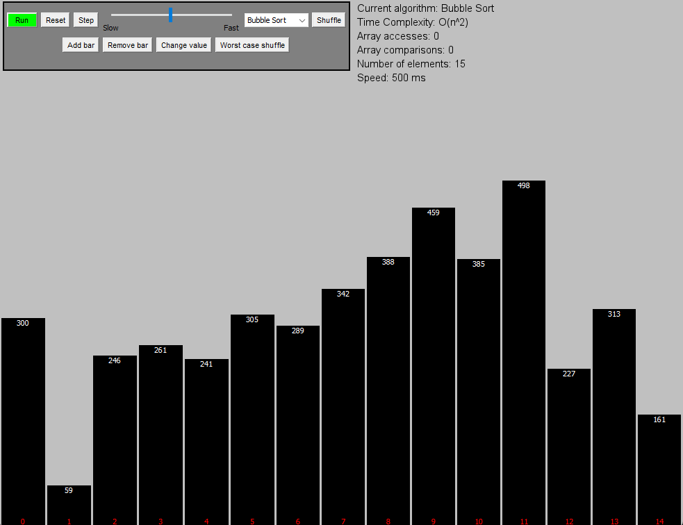

[![Contributors][contributors-shield]][contributors-url]
[![Forks][forks-shield]][forks-url]
[![Stargazers][stars-shield]][stars-url]
[![Issues][issues-shield]][issues-url]
[![MIT License][license-shield]][license-url]
[![LinkedIn][linkedin-shield]][linkedin-url]

<!-- PROJECT LOGO -->
 

  

  <h3 align="center">
    SortingAlgo
  </h3>

  

    A sorting algorithm visualizer
     
    <a href="https://github.com/chrkj/SortingAlgo"><strong>Explore the docs »</strong></a>
     
     
    <a href="https://github.com/chrkj/SortingAlgo/issues">Report Bug</a>
    ·
    <a href="https://github.com/chrkj/SortingAlgo/issues">Request Feature</a>

  

<!-- ABOUT THE PROJECT -->
## About The Project
I built this application because I wanted to visualize sorting algorithms to get a more intuitive understanding
of what was happening. The visualizer supports pausing and stepping through the sorting process of the algorithm, which
I found surprisingly few visualizers had.

(<a href="#top">back to top</a>)

<!-- ROADMAP -->
## Roadmap
The bars
- ✅ Fix repaint issue for GUI when data changes
- ✅ Implement the ability to increase the number of JBarComponents
- ✅ Refactor spacers (createRigidArea) like JBarComponent
- ✅ Add height of JBarComponents as a text field to the components
- ✅ Add index label to bars
- ✅ Fix spacing problems when adding multiple new JBarComponents
- ✅ Add min constrain to the amount of bars
- ✅ Dynamic coloring of the index values
- ✅ Add functionality to specify bar values

The settings GUI
- ✅ Add the settings panel
- ✅ Add run button
- ✅ Add speed slider
- ✅ Add Algorithm selector
- ✅ Fix speed slider values
- ✅ Add array accesses /- compare counter
- ✅ Add bar counter field
- ✅ Make "Stop" not sort the rest of the array
- ✅ Make some settings inactive while running
- ✅ Make pause / step button and functionality
- ✅ Make custom icon
- ⬜ Organize settings panel
- ⬜ Make height of the bars relative to the window

The algorithms
- ✅ Add Bubblesort
- ✅ Add Insertionsort
- ✅ Add Selectionsort
- ✅ Add Quicksort
- ✅ Add Heapsort
- ✅ Resolve runtime errors (concurrency)
- ✅ Optimize rendering
- ⬜ Add Mergesort (Better visual)
- ⬜ Add Shuffle worst case based on algorithm
    - ✅ Bubblesort
    - ✅ SelectionSort
    - ✅ InsertionSort
    - ⬜ HeapSort
    - ⬜ MergeSort
    - ⬜ QuickSort

(<a href="#top">back to top</a>)

<!-- LICENSE -->
## License

Distributed under the MIT License. See `LICENSE.txt` for more information.

(<a href="#top">back to top</a>)

<!-- MARKDOWN LINKS & IMAGES -->
[contributors-shield]: https://img.shields.io/github/contributors/chrkj/SortingAlgo.svg?style=for-the-badge
[contributors-url]: https://github.com/chrkj/SortingAlgo/graphs/contributors

[forks-shield]: https://img.shields.io/github/forks/chrkj/SortingAlgo.svg?style=for-the-badge
[forks-url]: https://github.com/chrkj/SortingAlgo/network/members

[stars-shield]: https://img.shields.io/github/stars/chrkj/SortingAlgo.svg?style=for-the-badge
[stars-url]: https://github.com/chrkj/SortingAlgo/stargazers

[issues-shield]: https://img.shields.io/github/issues/chrkj/SortingAlgo.svg?style=for-the-badge
[issues-url]: https://github.com/chrkj/SortingAlgo/issues

[license-shield]: https://img.shields.io/github/license/chrkj/SortingAlgo.svg?style=for-the-badge
[license-url]: https://github.com/chrkj/SortingAlgo/blob/master/LICENSE

[linkedin-shield]: https://img.shields.io/badge/-LinkedIn-black.svg?style=for-the-badge&logo=linkedin&colorB=555
[linkedin-url]: https://www.linkedin.com/in/christian-kjaer/
